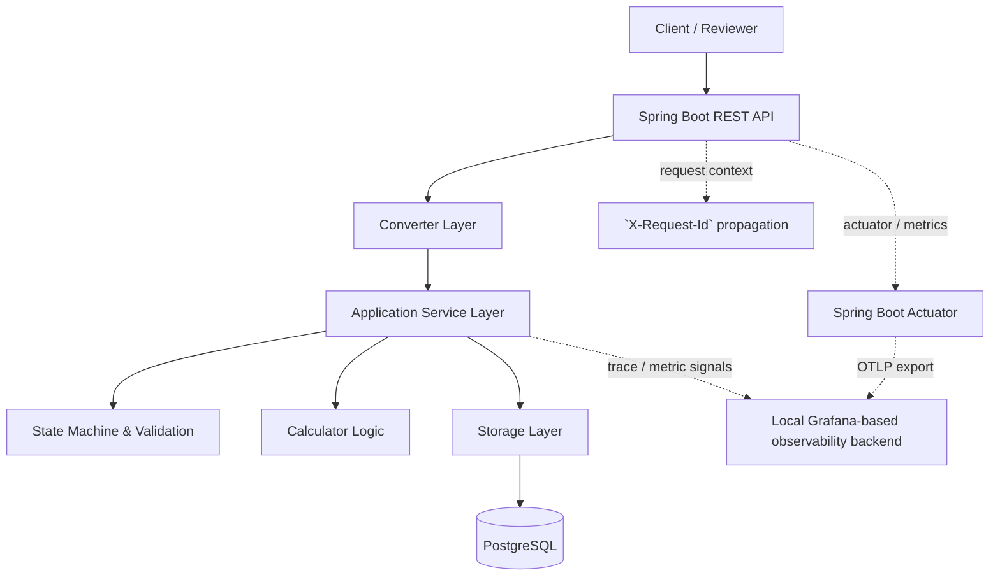
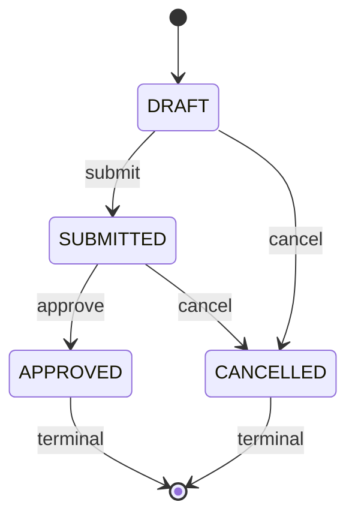

# Order Management API

Backend coding assignment implemented with **Spring Boot**, **Java 21**, **PostgreSQL**, and **MyBatis**.

**What you can review in ~1 minute**
- REST API under `/api/v1` with OpenAPI spec (`src/main/resources/openapi/api.yaml`)
- Order creation uses **snapshot pricing/tax** (historical accuracy) and **soft delete** (auditability)
- Controlled updates via **state machine** + PostgreSQL **transaction-scoped advisory locks**
- End-to-end request correlation via `X-Request-Id` (header + error body)
- Optional local observability via **Spring Boot Actuator + OTLP export** into a Grafana-based local stack

## Quick Start (Local)

### Prerequisites
- Java 21
- A container runtime compatible with Docker Compose workflows, such as **Docker** or **Podman** (for local Postgres + optional observability stack)

### 1) Start dependencies
```bash
docker compose up -d postgres lgtm
```
This starts:
- `postgres`: local PostgreSQL for the assignment data
- `lgtm`: local observability stack for traces / metrics / logs

### 2) Initialize the database (schema + seed)
This repo provides SQL scripts (not auto-applied):
- `src/main/resources/sql/schema.sql`
- `src/main/resources/sql/seed.sql`

If you use the provided container:
```bash
docker exec -i order-management-postgres psql -U postgres -d order_management < src/main/resources/sql/schema.sql
docker exec -i order-management-postgres psql -U postgres -d order_management < src/main/resources/sql/seed.sql
```

### 3) Run the API
```bash
./gradlew bootRun
```

### 4) API docs (local profile)
`spring.profiles.active` defaults to `local`, which enables Springdoc:
- Swagger UI: `http://localhost:8080/swagger-ui.html`
- OpenAPI JSON: `http://localhost:8080/api-docs`

## Assignment Coverage

### Functional requirements / assumptions
- Inventory is out of scope (assume unlimited product quantity).
- Product unit price and category tax rate can change over time.
- Order stores **unitPriceSnapshot** and **taxRateSnapshot** at creation and does **not** retroactively change when master data changes.
- Records remain traceable even after deletion (soft delete).

### Implemented endpoints
| Endpoint | Behavior | Notes |
|---|---|---|
| `GET /api/v1/product/{product_id}` | Retrieve active product | 404 if not found |
| `POST /api/v1/order` | Create order with snapshot price/tax | Validates `expectedUnitPrice` + `expectedTaxRate` against current master data |
| `PATCH /api/v1/order/{order_id}` | Controlled update (orderAmount only) | Guarded by state machine + serialized per-order patch flow |
| `DELETE /api/v1/order/{order_id}` | Soft delete order | Returns 204 |
| `DELETE /api/v1/user/{userId}` | Soft delete user + cascade order soft delete | Returns 204 |
| `GET /api/v1/order/{userId}` | Paged orders by user | 1-indexed pagination; newest-first sorting |

## Key Design Decisions (Current Implementation)

- **Snapshot Pattern**: orders store `unitPriceSnapshot` + `taxRateSnapshot` at creation for accounting correctness.
- **Soft Delete**: users/orders are not physically deleted; they are removed from “active” operations but remain auditable.
- **Controlled updates**: PATCH is constrained by an order state machine; illegal edits fail fast.
- **Concurrency control**: patch flow acquires a PostgreSQL **transaction-scoped advisory lock** per order id.
- **Pagination**: offset-based, 1-indexed `page` with deterministic sorting (**created_at DESC, id DESC**).
- **Observability**: `X-Request-Id` is generated/propagated per request; errors include `requestId` in the JSON body.

## Cross-Cutting Concerns & Tooling

The project includes a few cross-cutting engineering choices that are worth surfacing explicitly, because they show how the API is designed to remain operable and explainable, not just functionally correct.

| Concern / feature | Current approach | Why this approach fits this project | Trade-offs / limitations |
|---|---|---|---|
| Audit trail (documented design) | **AOP** around application/service operations | Centralizes repetitive audit capture, keeps service methods focused on domain logic, and makes it easier to add actor / action / before-after snapshots consistently | Can hide control flow, debugging is slightly less direct, and complex business-specific audit logic should not be pushed too far into aspects |
| Observability / o11y | **Spring Boot Actuator + OTLP export to a local Grafana-based stack** | Exposes reviewer-visible operational endpoints and exports telemetry through standard OTLP endpoints, which keeps local verification simple and avoids vendor lock-in at the API boundary | Adds local setup overhead, requires extra containers, and the current scope focuses on traces/metrics export rather than a fully built-out observability platform |
| Request correlation | **`X-Request-Id` propagation** in request/response/error flow | Makes troubleshooting easier even without full distributed tracing and gives a reviewer a concrete example of operational readiness | Simpler than full trace context propagation; by itself it does not replace end-to-end distributed tracing |

### Why AOP for audit?
- Good fit for repeated, operation-level audit hooks such as create order, patch order, delete order, and delete user.
- Helps avoid scattering similar logging/audit code across controllers and services.
- Best used for **technical audit capture** and consistent interception points; complex domain approval history should still be modeled explicitly in the domain/data layer when needed.

### Why this o11y setup?
- The application exposes operational endpoints through **Spring Boot Actuator**.
- It exports telemetry using **OTLP**, including traces and metrics.
- The local Grafana-based stack makes this easy for a reviewer to inspect without requiring external infrastructure.
- This is intentionally stronger than plain application logging because it demonstrates a real observability integration path, while still staying lightweight for a coding assignment.

## Example Requests (using seeded data)

Seeded IDs come from `src/main/resources/sql/seed.sql`:
- `USER_ID=52d3b753-b7d5-41a5-adf8-c967308aa9ba`
- `PRODUCT_ID=321bca7a-7b1e-4064-be7a-557318a3e2eb`

Get product:
```bash
curl -sS http://localhost:8080/api/v1/product/321bca7a-7b1e-4064-be7a-557318a3e2eb
```

Create order (expects unit price `0.0001`, tax rate `0.0003` from seed):
```bash
curl -sS -X POST http://localhost:8080/api/v1/order \
  -H 'Content-Type: application/json' \
  -H 'Idempotency-Key: demo-1' \
  -d '{"userId":"52d3b753-b7d5-41a5-adf8-c967308aa9ba","productId":"321bca7a-7b1e-4064-be7a-557318a3e2eb","orderAmount":2,"expectedUnitPrice":0.0001,"expectedTaxRate":0.0003}'
```

List orders (paged):
```bash
curl -sS "http://localhost:8080/api/v1/order/52d3b753-b7d5-41a5-adf8-c967308aa9ba?page=1&size=20"
```

## How to Test
```bash
./gradlew test
```

## Configuration Notes
- Datasource can be overridden with env vars:
  - `SPRING_DATASOURCE_URL` (default `jdbc:postgresql://localhost:5432/order_management`)
  - `SPRING_DATASOURCE_USERNAME` / `SPRING_DATASOURCE_PASSWORD` (default `postgres` / `postgres`)
- Observability stack (optional) is included in `docker-compose.yaml` (`grafana/otel-lgtm`) and wired via `OBSERVABILITY_OTLP_BASE_URL` (default `http://localhost:4318`).
- Spring Boot Actuator endpoints are exposed for local inspection: `health`, `info`, `metrics`, `prometheus`, `loggers`.
- Tracing uses **W3C Trace Context** propagation.
- OTLP export is configured for:
  - metrics -> `${OBSERVABILITY_OTLP_BASE_URL}/v1/metrics`
  - traces -> `${OBSERVABILITY_OTLP_BASE_URL}/v1/traces`

## Local Observability URLs
When you start `lgtm` via Docker Compose, you can inspect the local observability backend with:

| Tool | URL | Purpose |
|---|---|---|
| Grafana | `http://localhost:3000` | Unified entry point for telemetry exploration |
| OTLP gRPC ingest | `http://localhost:4317` | OTLP gRPC ingest endpoint |
| OTLP HTTP ingest | `http://localhost:4318` | OTLP HTTP ingest endpoint used by the application |

Recommended reviewer path:
1. Open **Grafana** first.
2. Trigger a few API requests locally.
3. Use the generated `X-Request-Id` to correlate application behavior with traces and operational signals.

This makes the observability setup feel like a reviewable engineering choice instead of a purely decorative dependency.

## Architecture (Layering)

All requests follow a strict flow:
`Controller` → `Converter (to DTO)` → `Service` → `Storage` → `Mapper/Entity` → `Service` → `Converter (to DTO)` → `Controller` → `Converter (to response)` → `Response`

### High-Level Architecture

```text
+---------------------+          +---------------------+
| Client / Reviewer   |          | Local o11y backend  |
| curl / Swagger UI   |          | Grafana / OTLP      |
+----------+----------+          +----------+----------+
           |                                ^
           v                                |
+---------------------+                     |
| Spring Boot API     |---------------------+
| Controller layer    |   Actuator / OTLP export
| Validation          |
| Exception handling  |
+----------+----------+
           |
           v
+---------------------+
| Application Layer   |
| Order service       |
| Product service     |
| State machine       |
| Calculator logic    |
+-----+-----------+---+
      |           |
      |           v
      |   +------------------------------+
      |   | Cross-cutting concerns       |
      |   | - X-Request-Id correlation   |
      |   | - Actuator endpoints         |
      |   | - OTLP trace/metric export   |
      |   +------------------------------+
      |
      v
+---------------------+
| Storage / MyBatis   |
| Repository layer    |
+----------+----------+
           |
           v
+---------------------+
| PostgreSQL          |
| users / products /  |
| product_categories /|
| orders              |
+---------------------+
```

### System Architecture


### Order Lifecycle (State Machine)


## Future Improvements (Explicitly not implemented yet)
- Enforce true request **idempotency** for `POST /api/v1/order` (header is part of the contract; dedup is TODO in service layer).
- Add database migrations (e.g., Flyway/Liquibase) and automate schema/seed for local runs.
- Tighten API docs UX (keep Swagger UI spec source aligned with the served OpenAPI endpoint).
- Expand observability beyond the current baseline by adding more reviewer-visible operational signals, such as request latency, error rate, and order workflow metrics.
- Add dashboards and monitoring views for core system behavior, such as API errors, slow requests, and order lifecycle transitions.
- Strengthen correlation across logs, traces, and metrics so troubleshooting paths are more complete during local review and future production handoff.
