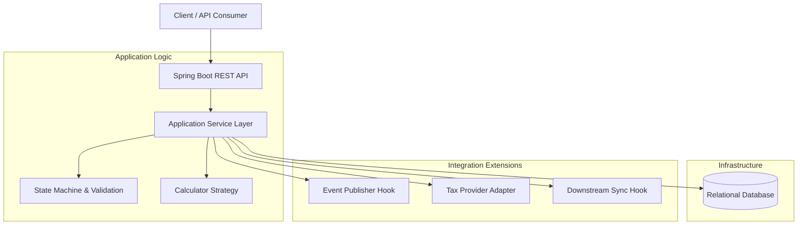
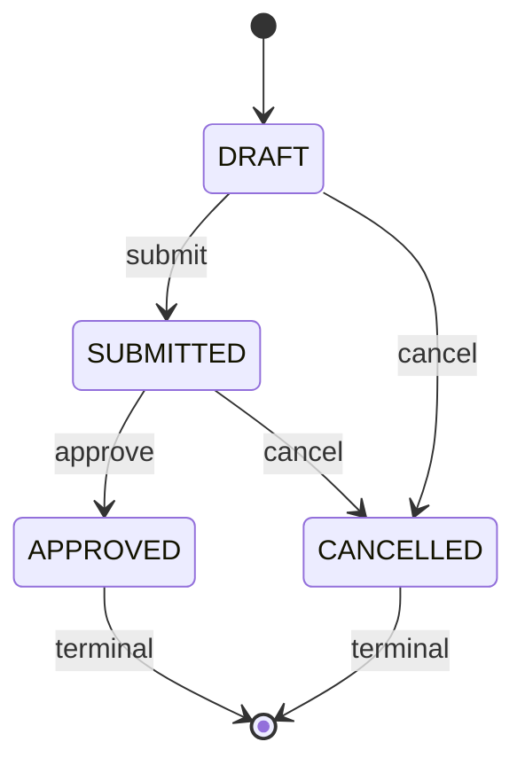

# Order Management API

## 1. Overview
This is an enterprise-grade Order Management API designed to handle order lifecycles with a focus on data consistency, auditability, and scalability.

## 2. API Design & Compliance Note
- **Assignment Compliance**: This implementation strictly follows the assignment endpoints:
  - `GET /api/product/{product_id}`
  - `POST /api/order`
  - `PATCH /api/order/{order_id}`
  - `DELETE /api/order/{order_id}`
  - `DELETE /api/user/{userId}`
  - `GET /api/order/{userId}`
- **Production-Oriented Redesign**: In a production environment, we recommend:
  - `GET /api/users/{userId}/orders` for querying orders by user.
  - State transition actions (submit, approve, cancel) should be exposed via command-style endpoints (e.g., `POST /api/orders/{id}:submit`) instead of generic patch.

## 3. System Architecture

## 4. Order Lifecycle (State Machine)

## 5. Business Context & Design Decisions

### Data Consistency
- **Snapshot Pattern**: `unitPriceSnapshot` and `taxRateSnapshot` are stored on the order at creation time to ensure historical pricing and tax calculations remain immutable despite future changes to master data.
- **Soft Deletion**: We adopt a soft-delete strategy for both `User` and `Order` to preserve business record history while removing active visibility from normal operations.

## 5. Design Concepts & Future Evolution (P2 & P3)
This section outlines architectural considerations and design patterns planned for future versions, demonstrating the system's readiness for enterprise-scale requirements.

### P2 — Documented Design Concepts
The following features are designed but intentionally out of scope for the current implementation to focus on core stability.

- **Change History & Audit Trail**: Implementation of an `OrderChangeHistory` table to track every state transition and field modification for compliance and auditability.
- **Risk Visibility**: Introduction of a `RiskFlag` system to highlight orders requiring manual intervention (e.g., high-value orders or suspicious activity).
- **Multi-Role Collaboration**: A robust permission model differentiating roles like *Buyer*, *Supplier*, and *System Operations* for controlled access.
- **Event-Driven Notification Center**: Using a message broker (e.g., Kafka) to decouple order creation from various notification channels (Email, SMS, Push).
- **Real-time Tax Integration**: An internal tax abstraction layer ready to integrate with third-party tax services for dynamic, regional tax rate adjustments.
- **Scalable Category Strategy**: An advanced **Strategy Pattern** implementation for calculations that can evolve independently as product categories grow.
- **Advanced Rate Limiting**: Distributed rate limiting using Redis and Bucket4j to enforce per-user usage quotas (e.g., 5,000 req/hr).
- **Downstream Data Synchronization**: A scheduled or event-driven sync service to pass anonymized purchasing habit data to external analytics apps every 30 minutes.

### P3 — Future Interview & Architecture Topics
Prepared for deeper technical discussion during the interview process.

- **Supplier Compliance Extension**: Integrating onboarding and compliance checks into the order submission workflow.
- **Logistics & Shipment Integration**: Extending the order aggregate to handle fulfillment milestones and tracking.
- **Soft Delete vs Hard Delete Rationale**: Deep dive into business record consistency, data privacy (GDPR), and audit requirements.
- **Microservices Evolution**: Strategy for decomposing the monolith into event-driven microservices.
- **Observability & SLO**: Implementing structured logging, distributed tracing (Zipkin/Jaeger), and operational metrics to ensure service reliability.

## 6. Operational Readiness
The system is built with enterprise observability in mind:
- **Traceability**: Consistent `traceId` across all API responses.
- **Error Handling**: A centralized exception hierarchy with standardized error codes.
- **Metrics**: Ready for instrumentation with metrics for order lifecycle events, transition errors, and downstream delivery performance.
