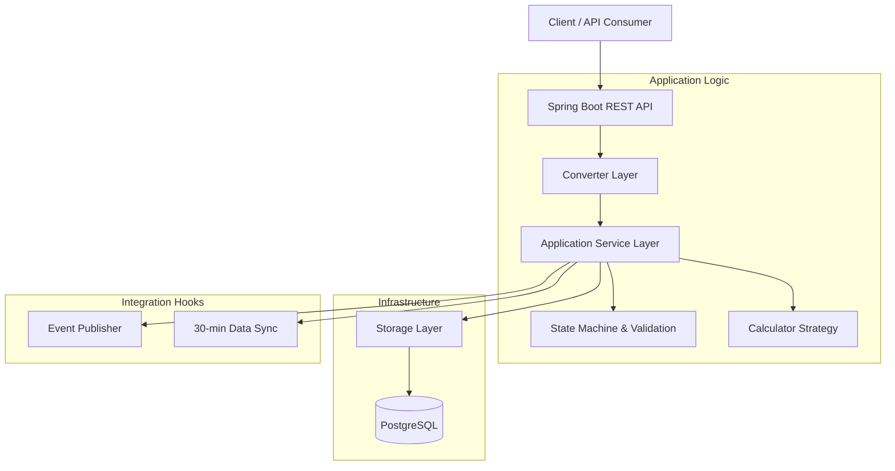
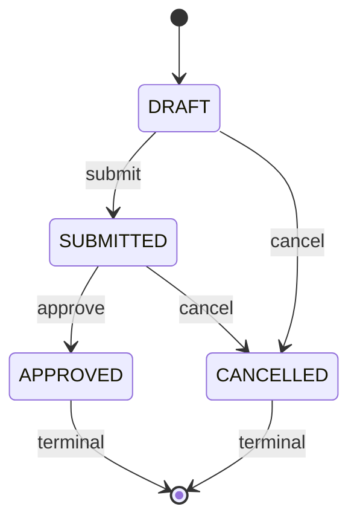

# Order Management API

## 1. Overview
An enterprise-grade Order Management API built with **Spring Boot 3** and **Java 21**, specifically designed for **B2B retail supply chain** scenarios. This system emphasizes data consistency, high-performance concurrency, and professional observability.

## 2. Technical Stack
- **Runtime**: Java 21 (Long-Term Support)
- **Concurrency**: **Virtual Threads (Project Loom)** enabled for high-throughput I/O.
- **Server**: **Jetty** (Optimized for modern cloud-native workloads).
- **Database**: **PostgreSQL** (Utilizing Writable CTEs for complex transactions).
- **ORM**: **MyBatis** (For precise control over SQL performance).
- **Testing**: **Groovy + Spock** (For readable and expressive specifications).

## 3. Architecture & API Design
### System Layers
`Controller` -> `Converter` -> `Service` -> `Storage` -> `Service` -> `Controller` -> `Converter` -> `Response`

### Key Design Patterns
- **API Versioning**: Global versioning via `/api/v1` prefix to ensure contract stability.
- **Data Consistency**:
  - **Snapshot Pattern**: Locks `unitPrice` and `taxRate` at order creation to preserve historical accuracy.
  - **Soft Deletion**: Implemented for both Users and Orders to maintain business history.
- **Pagination**: Nested wrap structure (`pagination` + `data`) with **1-indexed** page numbers and deterministic sorting (**created_at DESC, id DESC**).
- **Observability**: Full-stack traceability via **`X-Trace-Id`** (exposed in both body and headers).

## 4. System Architecture (Mermaid)

## 5. Order Lifecycle (State Machine)

## 6. Business Context & Design Decisions
### Data Consistency & History
- **Single Source of Truth**: The **Snapshot Pattern** ensures that even if a product's price or a category's tax rate changes in the future, historical orders remain immutable and accurate for accounting.
- **Record Preservation**: We adopt **Soft Deletion** because in enterprise systems, business records (Users/Orders) are rarely hard-purged. They are preserved for auditability and downstream analysis.

### Semantic Correctness
- **Controlled Patch**: Only `orderAmount` is mutable. State transitions (e.g., approval) are guarded by a state machine to prevent illegal workflow jumps.
- **Explicit Deletion**: Deleting a user triggers a cascade of soft-deletions for their orders, ensuring no orphaned active references remain in the execution plane.

## 7. Design Concepts & Future Evolution (P2 & P3)

### P2 — Documented Design Concepts
The following features are designed but intentionally out of scope for the current implementation to focus on core stability.

- **Change History & Audit Trail**: Implementation of an `OrderChangeHistory` table to track every state transition and field modification for compliance and auditability.
- **Risk Visibility**: Introduction of a `RiskFlag` system to highlight orders requiring manual intervention (e.g., high-value orders or suspicious activity).
- **Multi-Role Collaboration**: A robust permission model differentiating roles like *Buyer*, *Supplier*, and *System Operations* for controlled access.
- **Event-Driven Notification Center**: Using a message broker (e.g., Kafka) to decouple order creation from various notification channels (Email, SMS, Push).
- **Real-time Tax Integration**: An internal tax abstraction layer ready to integrate with third-party tax services for dynamic, regional tax rate adjustments.
- **Scalable Category Strategy**: An advanced **Strategy Pattern** implementation for calculations that can evolve independently as product categories grow.
- **Advanced Rate Limiting**: Distributed rate limiting using Redis and Bucket4j to enforce per-user usage quotas (e.g., 5,000 req/hr).
- **Downstream Data Synchronization**: A scheduled or event-driven sync service to pass anonymized purchasing habit data to external analytics apps every 30 minutes.

### P3 — Future Interview & Architecture Topics
Prepared for deeper technical discussion during the interview process.

- **Supplier Compliance Extension**: Integrating onboarding and compliance checks into the order submission workflow.
- **Logistics & Shipment Integration**: Extending the order aggregate to handle fulfillment milestones and tracking.
- **Soft Delete vs Hard Delete Rationale**: Deep dive into business record consistency, data privacy (GDPR), and audit requirements.
- **Pagination Strategy Evolution**: Why we chose Offset-based pagination for v1 (to support random page access for accounting) and how to transition to Cursor-based (Seek Method) for performance at scale.
- **Microservices Evolution**: Strategy for decomposing the monolith into event-driven microservices.
- **Observability & SLO**: Implementing structured logging, distributed tracing (Zipkin/Jaeger), and operational metrics to ensure service reliability.

## 8. API Compliance Details
Strictly following the assignment requirements while applying RESTful best practices:
- `GET /api/v1/product/{product_id}`: Retrieve active product details.
- `POST /api/v1/order`: Create order aggregate (Returns **201 Created** with `id`).
- `PATCH /api/v1/order/{order_id}`: Controlled update (only `orderAmount` mutable, returns recalculated order).
- `DELETE /api/v1/order/{order_id}`: Soft delete order record.
- `DELETE /api/v1/user/{userId}`: Delete User (Soft delete user and cascade soft-delete order references).
- `GET /api/v1/order/{userId}`: Get Order by User (Paged, newest-first).
